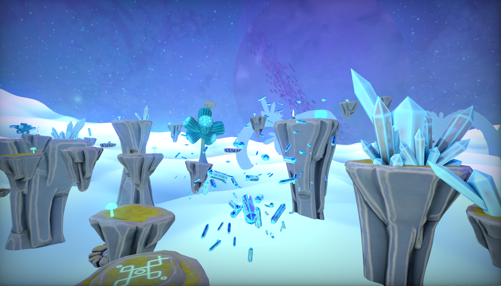

Puzzle-platformer 3D game with first person perspective.

In Delayed, you will play as a astronaut followed by his ghost from the past. The ghost will repeat all of your moves with delay of a few seconds. With its help, you will traverse the planet of levitating islands and collect missing parts of your broken spaceship. 

1. Cooparate with your own self from the past to solve puzzles.
2. Collect missing parts of your broken spaceship.
3. Upgrade your space suit to get new abilities.
4. Be aware of the mysterious obelisks, that have an impact on your ghost.

# Screenshots





# Technological Features

- [x] Physically Based Rendering
- [x] Image Based Lighting
- [x] Cascaded Shadow Maps (with PCF)
- [x] Screen Space Ambient Occlusion
- [x] Screen Space Reflections
- [x] Fast Approximate Anti-Aliasing
- [x] Post Processing (Bloom, Color grading, Vignette, Chromatic aberration)
- [x] Particle System
- [x] Deferred Rendering (for opaque materials) and Forward Rendering (for transparent materials)
- [x] Skeletal Animations
- [x] Animation State Machine (with blending)
- [x] Material System
- [x] Audio System
- [x] Collisions (Sphere, AABB, Ray Casting)
- [x] Profiler
- [x] Asset Manager
- [x] Input System
- [x] Optimization methods (Frustum Culling, Level of Detail, Material Sorting, Instanced Rendering)

# Editor

The editor is a separate project that we used to arrange the game scene, set parameters or create materials.


## Main Editor Windows:
- Content Browser - displays all assets that are contained in ```Content``` directory.
- Scene Hierarchy - displays all scene actors, allows to enable/disable actor or change its parent with simple drag and drop method.
- Renderer Settings - displays all of most important parameters, give possibility to modify them in real time.
- Details - displays only if actor is selected. Allows to add new components to selected actor or modify parameters of the existing ones.
- Material Editor - displays material parameters, allows to change them in real time or recompile shader.

# Getting started

1. Clone the repository
```
git clone https://github.com/matey-99/Delayed.git
```
2. Download FMOD Engine from https://www.fmod.com/download (FMOD Engine 2.02 for Windows) and install.
3. Find FMOD SoundSystem which was installed on your computer and go to api/core/lib/x64/ and copy all dlls and libs to Engine/ThirdParty/fmod/lib/x64/.
4. Download FreeType Windows libraries from https://github.com/ubawurinna/freetype-windows-binaries (FreeType 2.12.1) and copy .dll and .lib files from release dll/win64/ to Engine/ThirdParty/freetype/lib/win64/.
5. Launch ```GenerateProject.bat```. This file contains simple commands that make Build directory and create project files inside.
6. Open Visual Studio solution.
7. Select Delayed or Delayed_Editor as startup project.
8. Build.

# Authors

- Mateusz Michalak
- Jakub Berut
- Mateusz Majchrzak
- Michał Sobczak
- Paulina Stefańska
- Jagoda Gradek
